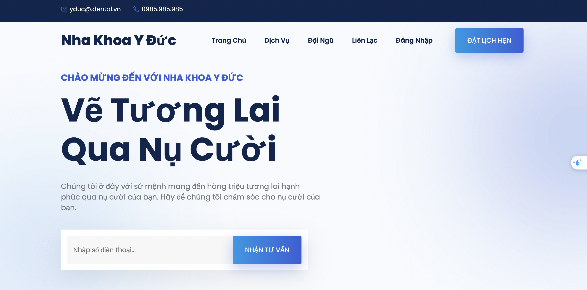

# Dental Clinic 

## Get started 
Please flow the step below
### 1.Download NodeJS and NPM package.[Install nodejs and npm with this doc.](https://vietdev.com/community/articles/cach-cai-dat-nodejs-va-npm-trong-windows-ubuntu-macos-XdHFis/)

### 2.Clone this project to your local enviroment.

```
git clone ``
```

### 3.Initialize database 
- Run code `create_and_generate.sql` in folder `/backend/database` to create database for using in this project.
- Update `PASSWORD_DB` in file **.env**
### 4.Install needed package 
Open the cloned project on the terminal and make sure you are at the root directory of the main project.
```
cd backend
```
Run code to create **node_modules**.

```
npm init
```

Run this code to install needed package denpend on `package.json`
```
npm install 
```
### 5.Run project
Using code to run project.
```
npm start
```
Open your browser and type localhost:8081.

## Team member 
- 21120240 - Nguyen Van Hao
- 21120272 - Truong Anh Khoa
- 21120504 - Nguyen Phuong Nam
- 21120516 - Vo Ba Hoang Nhat
- 21120525 - Le Van Dan Phong

## Purpose of this project
This repo for the Introduction to Software Engineering course project.